# quick-culvert-sizer

quick-culvert-sizer is intended for a user with a background in civil engineering, especially for those in a drainage and/or infrastructure. For others, this may only be a curious novelty.

In the civil engineering consulting sector, chasing new projects with proposals is routine. In this phase, the team needs to put together a preliminary design for the tender process of a RFP(Request for Proposal) and sub
mit a preliminary cost estimate as a part of this. At this stage, project engineers will need to create a drainage area map from contour maps which can take a few days. As part of this, a diligent civil engineer will analyse and comupute the time-of-concentration (Tc) for each drainage area. The time-of-concentration is the time in minutes for a raindrop to travel, from the most remote point and most likely path, to the point of intereset. With quick-culvert-sizer and once the time-of-concentration's are known (generally a few days) the user can use the results of this app to quickly select a reasonable design. No more "seat-of-the-pants" risky guessing. 

Incorrectly sizing a box culvert can lead to costly errors in the preliminary cost estimate (i.e. $250,000 vs maybe $50,000). Using this app, the user can get a "worst-case" but accurate design of the box-culvert required (if any). If the project proposal was successful (i.e. new project budget has been won), the engineering team can go to detailed design with much more effort and using quick-culvert-sizer results as a starting point. During detailed design, there should be no nasty surprises and the box-culvert size can only be smaller (i.e. cheaper). Also, phsical constraints can be managed and since if this is a roadway project and culvert geometry for roadway projects are the driving factor of vertical roadway alignment geometry. In turn, the vertical roadway geometry is the driver for earthwork (i.e. cut and fill quantities) which can be extremely expensive and cause a project to lose a lot of money.

Here is a flowchart of the process:

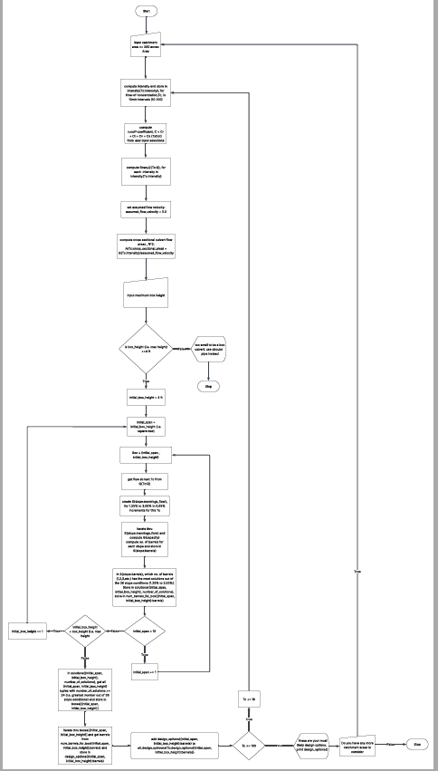

## Data Model

I have also used [Mermaid](https://mermaid.live) with ChatGPT to generate an interactive ERD of the project.

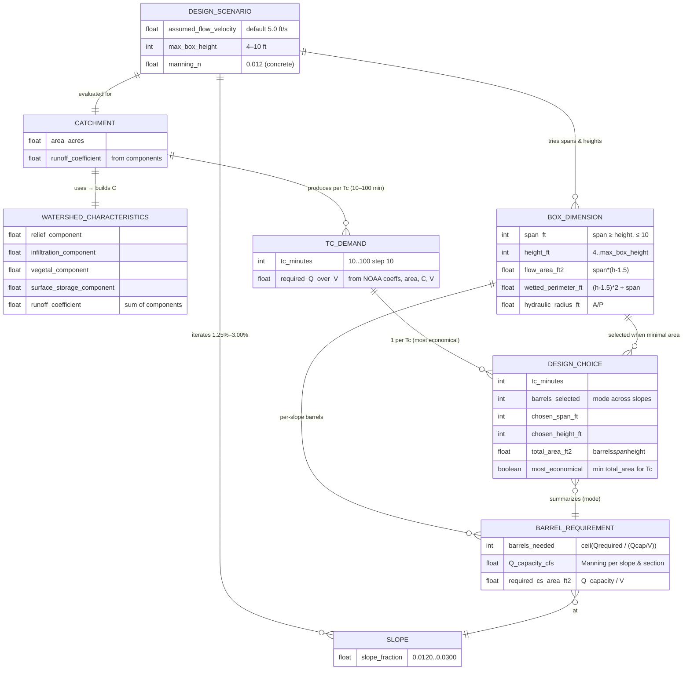

source: [mermaid](https://mermaid.live/edit#pako:eNqFVttu4zYQ_RWCwC6crKNIjt3YfnNlozGwsTe2mxaFAYKRRjZRSXRJKpdNAvSpwL5uf6H9sXxJRxfLsRSnfkkkcs6cOTwz1CP1pA-0T0ENBV8pHi1jgj93sHAvLkeTBXl6Ojl5eiK_DBaj2fxiNGTuxWA2cPFpPF-M3TnpkyVNNGjy8td3cpOI0NfEXdK3cOQjWbhsOLocTIZZ3EZJP_EwdgOKLDzScOyXP_92bJtEIj7aggxH8_FPEzZ3R5PBbDzdUtphp1Bwy8OEG_BJINV7kUhi_nn6ZZRFCQMKgzRxrFbnA-Y-s2z7w_-E_zj9lQ3HmHk-nk4yGKMEYugNjzX5SNYgVmujtyj727cYg9ls9JnNRlc_j2ejsgrU4USHcgPkhisFYQmy060AKLi5F9Oxm9filCpGUhsCnoxlJDweHr3LpA6kIQQvVfJuDXF6EiLiIeEKeAlUZ_8ss0PZSctNRcYiQ7HxgAA6iSKuxFeUE8vwIeNe9dJj_oKQIJTcZMwY9xTo_fcqiWUQME9CEAhPQGwIZgiUjIgno42M8U0p8PM2zWGnV9Li8QhI4Quo_VURByI0aC4h40N7bmEFhoeHlnWiAu4B00YqvoJD294uE4UkMniv0Kq7q6pqhACf4dMdu4VQesI8pMg-BDwJDelYNgnMaQlMsGZMTSJ-z27kPcvbgGx_S9rOehtjdhF5qojHsYhXLCZ7vyW1LdtpkQY6GU_XwFGthtxuFeZZA7FAcS8VvwpnWxb-PbPtGtiuxx73KzIewy5I0jmxz89BsHRaaQMb4tjVuhT8kQiFGl4xeQuKXW_jMg9OpoMByU5NNzMPN4nbJNc1WvtdW6GWzhwWGEKq0qUL5OXbv8U0auL__-xRzOPz1RoCHpZl7R9ktbjMF1nrBaZVzXzcWJ84VueoGnQHBgcLw0ElIjxQVSRe0mL_cYt8ymqqBq4ffIWuEx5T3BeJLgMHp1_qitVnS0W2YrqyGMDHQbcj74EIG1fbgyOnpHHl8c3p9VGtlCuGCzxtCuYF-hXEZe7mbBrns_wj0ZB58aBBPP1ayiXdgSOF60OtW0zUg259u-ZyvG8Jp3OW4PyUWueEay3traWGmBVme3OtNNJ-hUamA65mkyUt2Bxnbqk67EbKENC_6UXGdhdZSVjEr4DTCx-vvVIk2qQRqIgLH79rMm3wgl5DBEua3jA-V7-ne9N9PDFy_hB7tG9UAk2abHz8Gii-hLYvkSDtP9J72ndabavT6fbaTrfXOsMZctakD7Tf7lrn7V7vvN3t_tBqtZzuc5N-lRIBbKt73skQfsuec0Alk9Wa9gMeanxaqZRosQKxD8qVSWxov_f8HzjA67E)

## Features 

Command line driven app that accetps user input for a catchment area and runs up to 490 iterations to calculate the best box culvert design options and outputs to terminal.

## Testing 

### User input
  - __Input Catchment Area Size__

      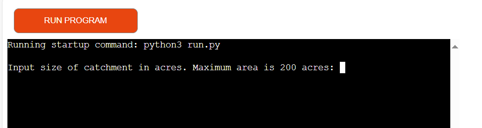

  - __Input Catchment Area Incorrect__

      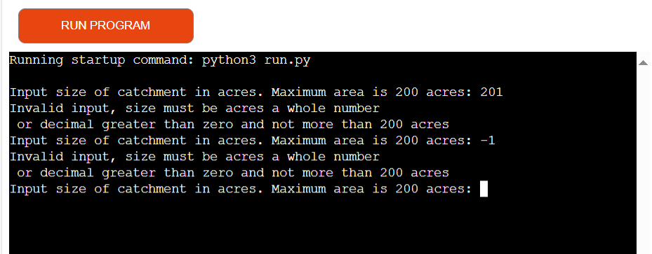

  - __Input Catchment Area Correct__

      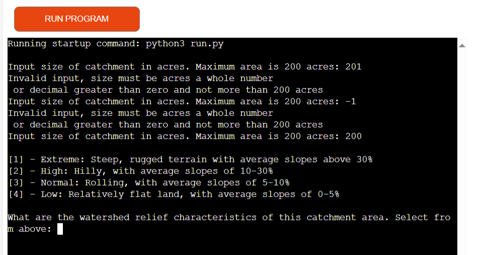

  - __Input Catchment Area Relief Incorreect__

      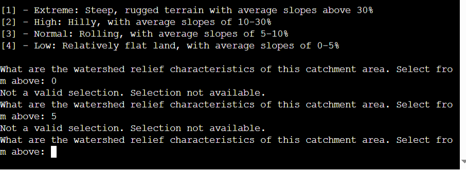

  - __Input Catchment Area Relief__

      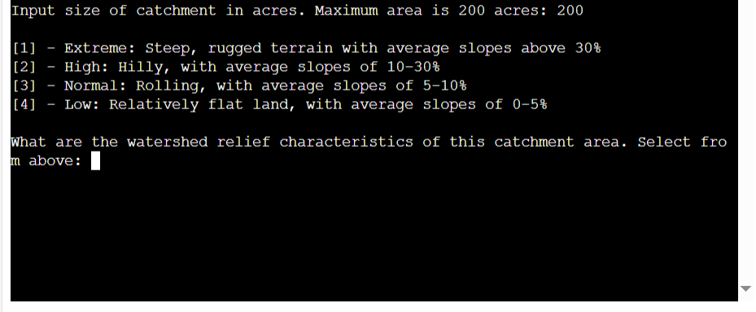

  - __Input Catchment Area Soil Infiltration__

      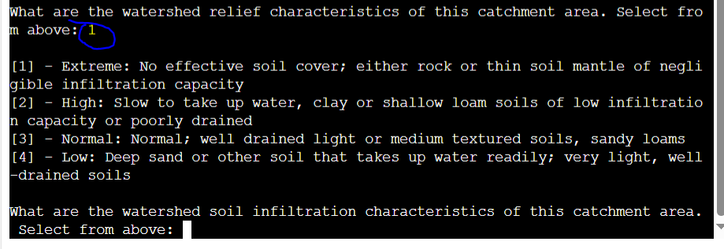

  - __Input Catchment Area Soil Infiltration Incorrect__

      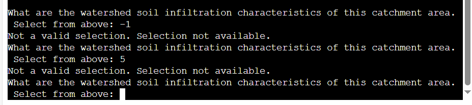

  - __Input Catchment Area Soil Infiltration Correct__
      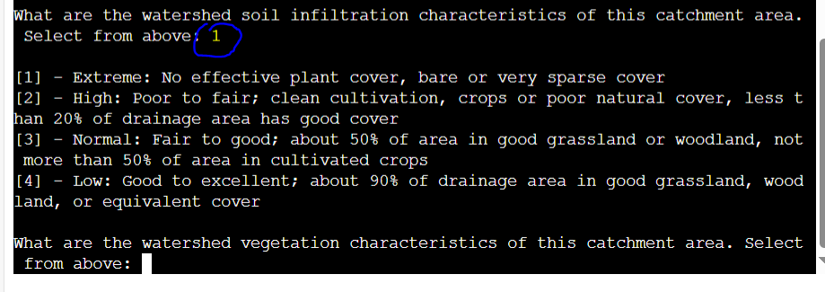

  - __Input Catchment Area Soil Vegetation Cover Incorrect__
      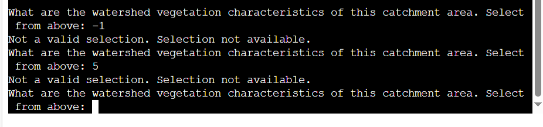

  - __Input Catchment Area Soil Vegetation Cover Correct__
      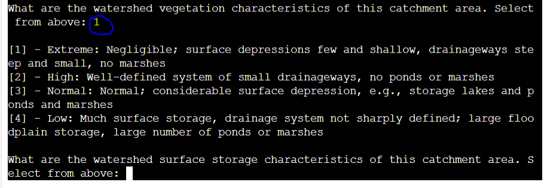

  - __Input Catchment Area Surface Storaage Incorrect__
      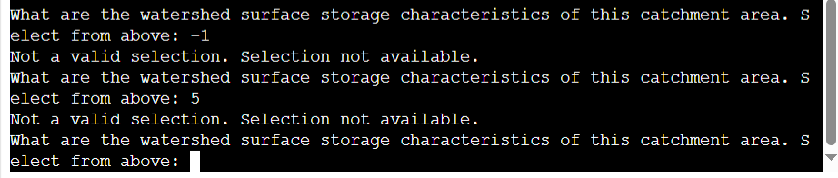

  - __Input Catchment Area Surface Storaage Correct__
      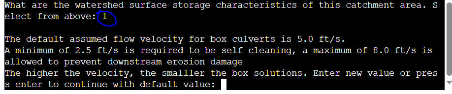

  - __Input Assumed Flow Velocity Incorrect__
      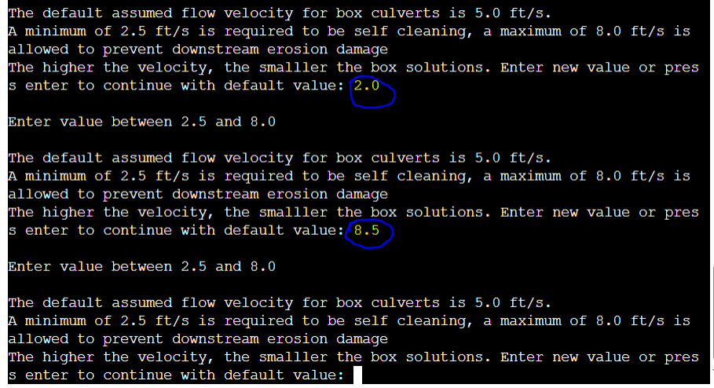

  - __Input Assumed Flow Velocity Correct__
      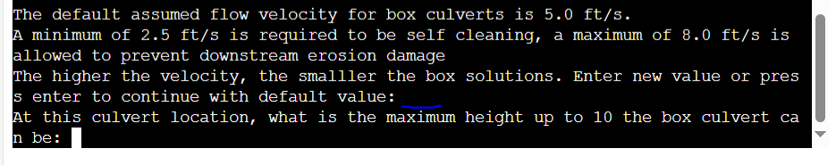

  - __Input Maximum Box Height__
      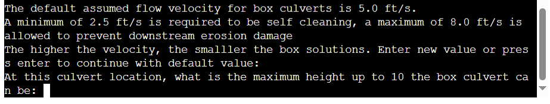

  - __Input Maximum Box Height Incorrect__
      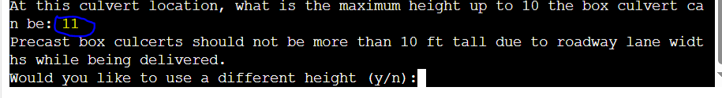

  - __Input Maximum Box Height Incorrect Repeat = No__
      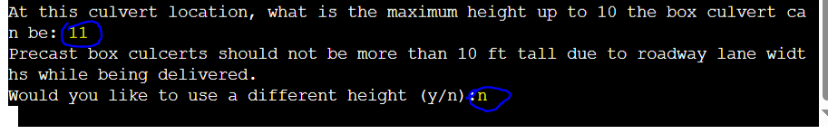

  - __Results Repeat = Yes__
      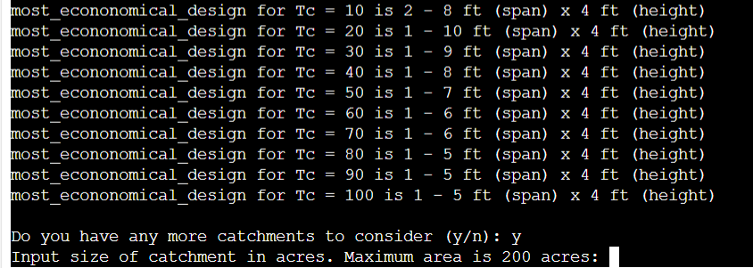

  - __Results Repeat = No__
      

  - __Expected Results__

      Since there can be hundreds of iteration it is only feasible to take a random iteration
      and compare it to an Excel solution for that iteration. A random iteration sample gives
      the results expected.

      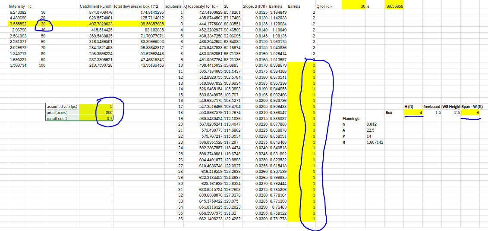

### Validator Testing 

- Flake8
  - No significant errors according to Flake8 Linting. A number of 'line too long' messages. Doing research on Google, this seems to be a legacy message from the past which is no longer relevant today.

### Unfixed Bugs

There are no remaining bugs that I am aware of, though, even after thorough testing, I cannot rule out the possibility.

## Deployment

### Heroku

This project uses [Heroku](https://www.heroku.com), a platform as a service (PaaS) that enables developers to build, run, and operate applications entirely in the cloud.

Deployment steps are as follows, after account setup:

- Select **New** in the top-right corner of your Heroku Dashboard, and select **Create new app** from the dropdown menu.
- Your app name must be unique, and then choose a region closest to you (EU or USA), then finally, click **Create App**.
- From the new app **Settings**, click **Reveal Config Vars**, and set the value of **KEY** to `PORT`, and the **VALUE** to `8000` then select **ADD**.
- Further down, to support dependencies, select **Add Buildpack**.
- The order of the buildpacks is important; select `Python` first, then `Node.js` second. (if they are not in this order, you can drag them to rearrange them)

Heroku needs some additional files in order to deploy properly.

- [requirements.txt](requirements.txt)
- [Procfile](Procfile)
- [.python-version](.python-version)

You can install this project's **[requirements.txt](requirements.txt)** (*where applicable*) using:

- `pip3 install -r requirements.txt`

If you have your own packages that have been installed, then the requirements file needs updated using:

- `pip3 freeze --local > requirements.txt`

The **[Procfile](Procfile)** can be created with the following command:

- `echo web: node index.js > Procfile`

The **[.python-version](.python-version)** file tells Heroku the specific version of Python to use when running your application.

- `3.12` (or similar)

For Heroku deployment, follow these steps to connect your own GitHub repository to the newly created app:

Either (*recommended*):

- Select **Automatic Deployment** from the Heroku app.

Or:

- In the Terminal/CLI, connect to Heroku using this command: `heroku login -i`
- Set the remote for Heroku: `heroku git:remote -a app_name` (*replace `app_name` with your app name*)
- After performing the standard Git `add`, `commit`, and `push` to GitHub, you can now type:
	- `git push heroku main`

The Python terminal window should now be connected and deployed to Heroku!

- If not available register and sign up for a Heroku account
- From dashboard click "Create New App" and enter name of app

    

- Name the app, select region, click "Create app"

    

- Name the app, select region, click "Create app"

    

- Click Github, search for your Github repository

    

- Using this already deployed app as an example, on the dashboard click on "Settings" and navigate  to "Buildpacks and add these items in this order while clicking "Add buildpack".

    

- By now you should be connected to Github, select "Deploy" from dashboard, and then click "Deploy branch" from "Manual deploy" section

    

- Once successfully deployed, open app in browser terminal

    

    

## Credits 

Texas Department of Transportation - Hydraulic Design Manual
NOAA National Weather Service https://hdsc.nws.noaa.gov/pfds/
Code Institute

### Content 

- Readme from Love Sandwiches was used as template

### Media

None 

## Other General Project Advice

Below you will find a couple of extra tips that may be helpful when completing your project. Remember that each of these projects will become part of your final portfolio so it’s important to allow enough time to showcase your best work! 

- One of the most basic elements of keeping a healthy commit history is with the commit message. When getting started with your project, read through [this article](https://chris.beams.io/posts/git-commit/) by Chris Beams on How to Write  a Git Commit Message 
  - Make sure to keep the messages in the imperative mood 

- When naming the files in your project directory, make sure to consider meaningful naming of files, point to specific names and sections of content.
  - For example, instead of naming an image used ‘image1.png’ consider naming it ‘landing_page_img.png’. This will ensure that there are clear file paths kept. 

